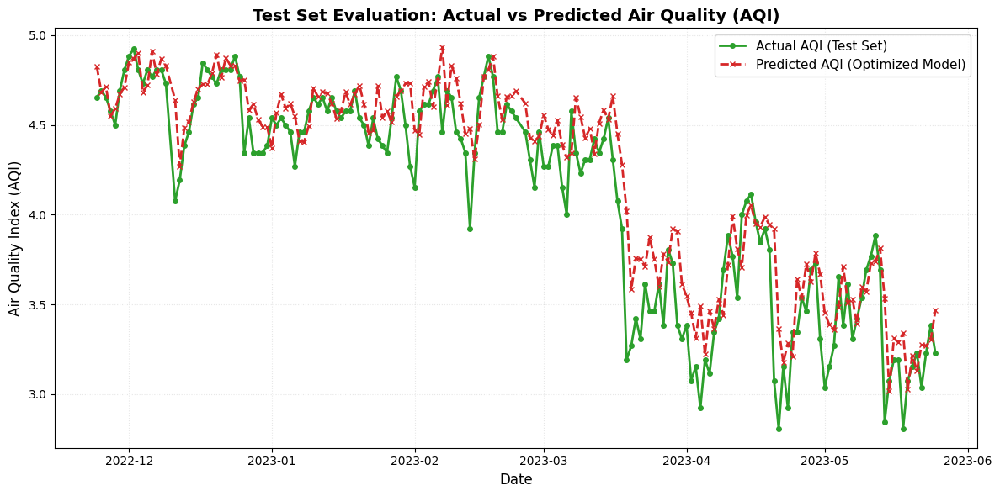
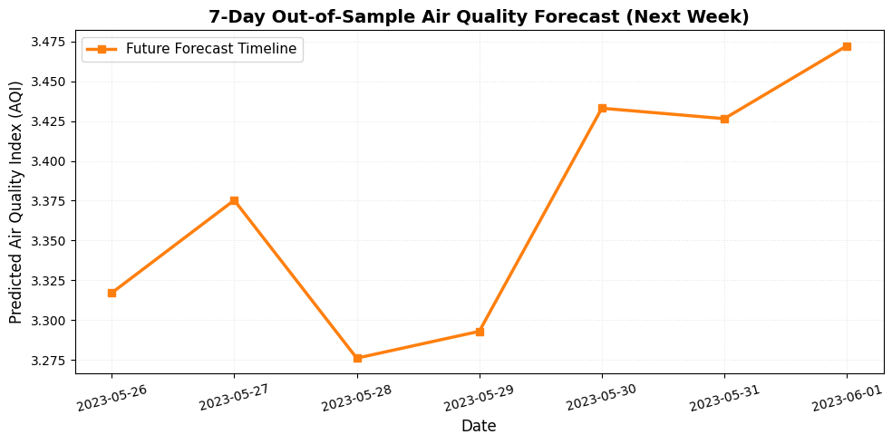

# Air Quality Prediction & Optimization Using Time-Series Machine Learning

[](https://www.python.org/)
[](https://scikit-learn.org/)
[](https://opensource.org/licenses/MIT)

## 📌 Project Overview
This project focuses on forecasting the Air Quality Index (AQI) using historical air pollution data spanning over 2.5 years. Initially built using a standard baseline forecasting approach, the project highlights a rigorous optimization process where feature engineering, hyperparameter tuning, and an autoregressive recursive forecasting architecture were implemented to drastically improve prediction accuracy.

## 🚀 Key Features & Architectural Upgrades
*   **Data Preprocessing & Aggregation:** Cleaned invalid/missing values, synchronized timelines, and engineered a unified, high-integrity daily national time-series dataset.
*   **Baseline vs. Optimized Modeling:** Shifted from a traditional curve-fitting Prophet configuration to an advanced autoregressive setup.
*   **Lag Feature Engineering:** Integrated a 1-day temporal lag (`aqi_lag_1`) to serve as a dynamic short-term memory regressor.
*   **Recursive Multi-Step Forecasting:** Implemented a custom out-of-sample forecasting loop to predict air quality into a future 7-day timeline sequentially.

## 🛠️ Tech Stack
*   **Language:** Python
*   **Environment:** Google Colab / Jupyter Notebooks
*   **Core Libraries:** `prophet`, `scikit-learn`, `pandas`, `numpy`
*   **Visualization:** `matplotlib`, `seaborn`

## 📈 Performance & Optimization Results

Through feature engineering and structural model tuning, prediction errors dropped significantly, and the variance explanation capability ($R^2$) quadrupled:

| Metric | Baseline Model | Optimized Autoregressive Model | Status |
| :--- | :---: | :---: | :---: |
| **R-squared ($R^2$)** | 0.2681 | **0.8520** | **+217.8% Improvement** |
| **Mean Absolute Error (MAE)** | 0.3950 | **0.1673** | **-57.6% Error Reduction** |
| **Root Mean Square Error (RMSE)** | 0.5083 | **0.2286** | **-55.0% Error Reduction** |

### Insights Derived:
1.  **Short-Term Dependency:** Adding the 1-day lag confirmed that immediate historical atmosphere conditions heavily dictate subsequent trends.
2.  **Seasonality:** The model accurately extracted macro-level yearly pollution patterns alongside distinct weekly human/industrial cycles.

## 💻 How to Run This Project

1.  **Clone the repository:**
    ```bash
    git clone https://github.com/YOUR_USERNAME/Air-Quality-Prediction.git
    cd Air-Quality-Prediction
    ```

2.  **Set up a virtual environment and install dependencies using `uv`:**

    ```bash
    # Create a virtual environment instantly
    uv venv

    # Activate the virtual environment
    # On macOS/Linux:
    source .venv/bin/activate

    # On Windows:
    .venv\Scripts\activate

    # Install all requirements using uv's high-speed pip implementation
    uv pip install -r requirements.txt
    ```

3.  **Run the Notebook:**
    Open `notebooks/Air_Quality_Prediction.ipynb` in Google Colab or launch your local environment's Jupyter server to execute the cells sequentially.
## 📊 Visualizations

*   ### Model Test Evaluation:  
*   ### 7-Day Future Horizon:  

---

## 3. High-Impact Resume Bullet Points
*Add this directly under your "Projects" section. It uses the **STAR** method and highlights metrics to optimize for ATS filters and recruiter attention.*

*   **Air Quality Prediction & Time-Series Optimization** | *Python, Prophet, Scikit-Learn, Pandas*
    *   Developed an end-to-end predictive time-series model to analyze and forecast multi-year daily Air Quality Index (AQI) patterns.
    *   Engineered a high-accuracy autoregressive pipeline utilizing 1-day temporal lag features (`aqi_lag_1`) and tuned changepoint priors to integrate short-term memory into a seasonal architecture.
    *   Boosted model performance metrics exponentially, shifting the baseline $R^2$ score from **0.2681 to 0.8520** while slashing Mean Absolute Error (MAE) by **57.6%**.
    *   Designed a custom recursive out-of-sample forecasting sequence to predict a clear, standalone 7-day future horizon timeline.

---

## 4. What's Next?
To further advance this project for machine learning recruitment:

1.  **Model Comparison:** Implement an **LSTM (Long Short-Term Memory)** neural network or an **XGBoost Regressor** using lag features to create a comparative study table.
2.  **Interactive Deployment:** Wrap the model logic in a `Streamlit` script and host it on Streamlit Community Cloud to allow users to view live interactive air quality forecasts.